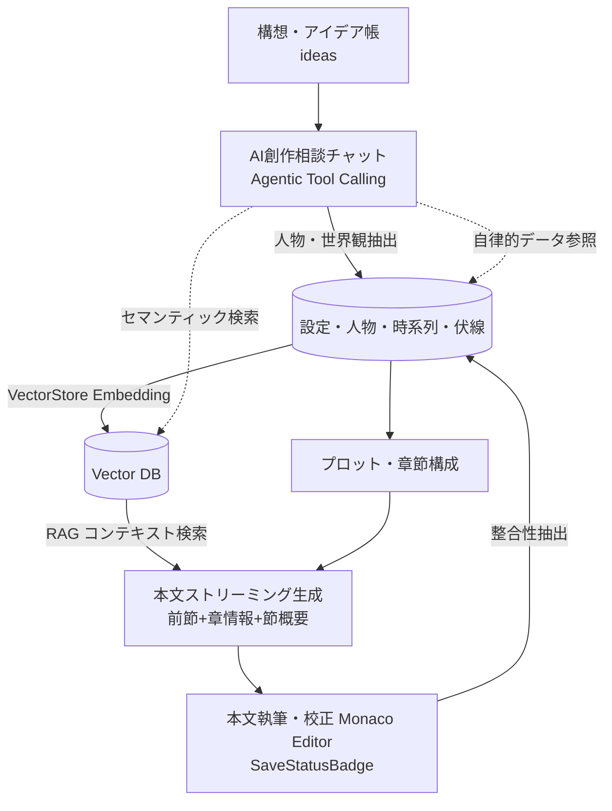

# Novel Creator ドキュメント

Novel Creator は、大規模言語モデル（LLM）とベクトル検索（RAG: Retrieval-Augmented Generation）を活用して、プロット作成・世界観・登場人物の構築から本文執筆・整合性管理までを一貫して支援する小説執筆支援システムです。

本ディレクトリ（`doc/`）では、システムの全体設計、データモデル、LLM/RAG連携、主要機能と業務フローについて詳細に解説しています。

---

## 📚 ドキュメント一覧

1. **[システムアーキテクチャ (`architecture.md`)](./architecture.md)**
   - 全体アーキテクチャとモノレポ構成（`apps/web`, `apps/api`, `packages/*`）
   - Hono RPC による完全型安全な通信 & AI SDK UI Message Stream / SSE ストリーミング
   - Agentic Tool Calling（LLM 自律ツール呼び出し & `ToolActivity` UI）
   - ローカル開発環境（Node.js + Docker PostgreSQL）とクラウド環境（Cloudflare Workers + Pages + Hyperdrive + Vectorize）のハイブリッド設計

2. **[データモデル & データベース設計 (`data-model.md`)](./data-model.md)**
   - RDB スキーマ定義（PostgreSQL + Drizzle ORM）と ER ダイアグラム
   - 各テーブルの責務（小説・章・節・本文・人物・設定・時系列・伏線・アイデア・分析結果・チャット履歴・編集履歴・指示履歴・MCPキー・LLM/Embedding設定）
   - ベクトルデータベース（VectorStore: pgvector / Vectorize）のデータ構造とインデックス設計
   - DB運用フロー（`db:migrate`、`db:reset`、`db:setup`）

3. **[LLM連携 & RAGアーキテクチャ (`llm-and-rag.md`)](./llm-and-rag.md)**
   - Vercel AI SDK による LLM / Embedding の抽象化
   - マルチプロバイダ対応（OpenAI / Anthropic / Google Gemini / Ollama）
   - Agentic ツール実行システム（`createReadTools`: 8種類の小説データ検索・取得ツール、`createProposeTools`: 7種類の設定提案ツール）
   - RAG パイプライン（セマンティック検索 → コンテキスト注入 → 本文/プロット生成）
   - 章情報を取り入れた本文生成プロンプトとバリエーション並列ストリーミング（SSE多重化）

4. **[機能詳細 & ワークフロー (`features-and-workflows.md`)](./features-and-workflows.md)**
   - 小説創作の標準ワークフロー（アイデア着想 → 構想 → プロット → 章・節構成 → 執筆 → 整合性フィードバック → 分析・推敲）
   - アイデア帳（`ideas`）とストーリーシード発想・ステータス管理（下書き/採用/却下）
   - AI 創作相談チャット（Creative Chat）と自律ツール呼び出し・登録提案カード（DiffEditor差分確認対応）
   - 執筆エディタ環境（`SaveStatusBadge` による保存状態リアルタイム同期、節メタ直接編集、Zen Mode）
   - 縦書き文庫ビューアー（ルビ・傍点対応）& インライン AI 推敲アシスタント
   - 複数候補のバリエーション並列生成 & 比較（タブ切替 / 2カラム Split View）
   - UI上からのカスタムプロンプト作成・登録・管理（変数タグワンクリック挿入）
   - キャラクター口調・一貫性チェッカー & 登場人物出現頻度ヒートマップ
   - 設定変更の影響範囲シミュレーター
   - 物語の感情アーク（起伏・テンション）分析 & 4ペルソナ模擬読者・編集部レビュー（進捗SSE通知・履歴管理）
   - 人物・設定の Markdown 双方向同期 & 個別編集ページ（AI下書き自動生成）
   - 人物相関図（Mermaid.js）の自動可視化
   - 章・節の並び替え・移動機能、伏線管理、時系列管理、校正、編集差分履歴（HistoryDiffModal）
   - バックアップ・リストア・整形テキストエクスポート

5. **[MCPサーバー (`mcp-server.md`)](./mcp-server.md)**
   - Streamable HTTP（`POST /api/mcp`）のみのトランスポート
   - Tools 55・Resources 5・Prompts 10 の一覧と用途（バッチ処理・アイデア支援を含む）
   - Web 発行キー（`mcp_api_keys`）による認証・管理者が設定画面で発行・失効
   - `section-guard` による節→章→小説の novelId 照合（横断参照の遮断）
   - ヘルスチェック・Prometheus風メトリクス・レート制限・サーキットブレーカー

---

## 💡 システムのコアコンセプト

1. **思考の中断を防ぐ双方向データ同期**:
   人物や設定を個別のフォームで入力・AI下書き生成するだけでなく、Markdown 形式で一括執筆・閲覧したり、AI 指示で特定セクションだけをピンポイント更新できます。エディタの保存状態は `SaveStatusBadge` で即座に確認できます。
2. **長編執筆におけるコンテキスト破綻の防止（RAG & Agentic Tools & 章文脈）**:
   本文執筆時の RAG 検索と章情報の統合に加え、創作相談チャットでは LLM 自らが小説データ（章、本文、登場人物、設定、伏線、年表）を必要に応じて自律検索（Tool Calling）して的確な提案を行います。
3. **継続的な整合性の再フィードバック & 履歴管理**:
   作成された本文から、登場人物の行動や新しい設定、時系列イベントを自動抽出し、データベースへ再反映するループを構築。また、AI による変更差分を `edit_histories` に保持し、いつでもロールバック可能です。
4. **アイデア発想から採用へのシームレスな昇華**:
   思いついたプロットや展開の種を `ideas` にストックし、評価プロンプトで検討した上で、ワンアクションで章・節プロットへ昇華できます。
