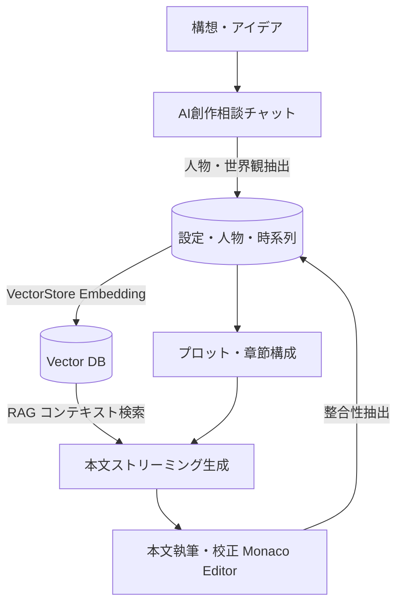

# Novel Creator ドキュメント

Novel Creator は、大規模言語モデル（LLM）とベクトル検索（RAG: Retrieval-Augmented Generation）を活用して、プロット作成・世界観・登場人物の構築から本文執筆・整合性管理までを一貫して支援する小説執筆支援システムです。

本ディレクトリ（`doc/`）では、システムの全体設計、データモデル、LLM/RAG連携、主要機能と業務フローについて詳細に解説しています。

---

## 📚 ドキュメント一覧

1. **[システムアーキテクチャ (`architecture.md`)](./architecture.md)**
   - 全体アーキテクチャとモノレポ構成（`apps/web`, `apps/api`, `packages/*`）
   - Hono RPC による完全型安全な通信 & SSE (Server-Sent Events) ストリーミング
   - ローカル開発環境（Node.js + Docker PostgreSQL）とクラウド環境（Cloudflare Workers + Pages + Hyperdrive + Vectorize）のハイブリッド設計

2. **[データモデル & データベース設計 (`data-model.md`)](./data-model.md)**
   - RDB スキーマ定義（PostgreSQL + Drizzle ORM）と ER ダイアグラム
   - 各テーブルの責務（小説・章・節・本文・人物・設定・時系列・伏線・チャット履歴・編集履歴）
   - ベクトルデータベース（VectorStore: pgvector / Vectorize）のデータ構造とインデックス設計

3. **[LLM連携 & RAGアーキテクチャ (`llm-and-rag.md`)](./llm-and-rag.md)**
   - Vercel AI SDK による LLM / Embedding の抽象化
   - マルチプロバイダ対応（OpenAI / Anthropic / Google Gemini / Ollama）
   - RAG パイプライン（セマンティック検索 → コンテキスト注入 → 本文/プロット生成）
   - 各種プロンプト設計とストリーミング生成制御

4. **[機能詳細 & ワークフロー (`features-and-workflows.md`)](./features-and-workflows.md)**
   - 小説創作の標準ワークフロー（構想 → プロット → 章・節構成 → 執筆 → 整合性フィードバック）
   - 人物・設定の Markdown 双方向同期（カード UI ⇄ Markdown 一括編集 ⇄ 自然言語差分編集）
   - 人物相関図（Mermaid.js）の自動可視化
   - AI 創作相談チャット（Creative Chat）とエンティティ自動抽出・反映機構
   - 伏線管理・時系列管理・校正・エクスポート/インポート

---

## 💡 システムのコアコンセプト

1. **思考の中断を防ぐ双方向データ同期**:
   人物や設定を個別のフォームで入力するだけでなく、Markdown 形式で一括執筆・閲覧したり、AI 指示で特定セクションだけをピンポイント更新できます。
2. **長編執筆におけるコンテキスト破綻の防止（RAG）**:
   本文執筆時、関連する人物・設定を pgvector / Vectorize から自動抽出し、LLM のプロンプトに動的注入することで設定の矛盾を防止します。
3. **継続的な整合性の再フィードバック**:
   作成された本文から、登場人物の行動や新しい設定、時系列イベントを自動抽出し、データベースへ再反映するループを構築しています。
