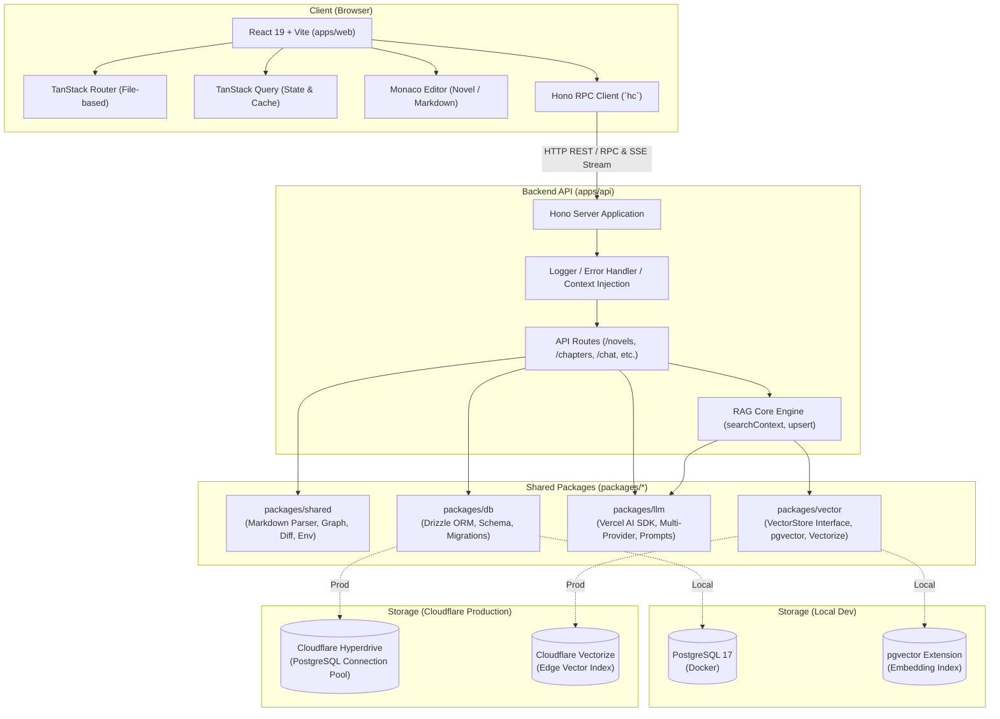
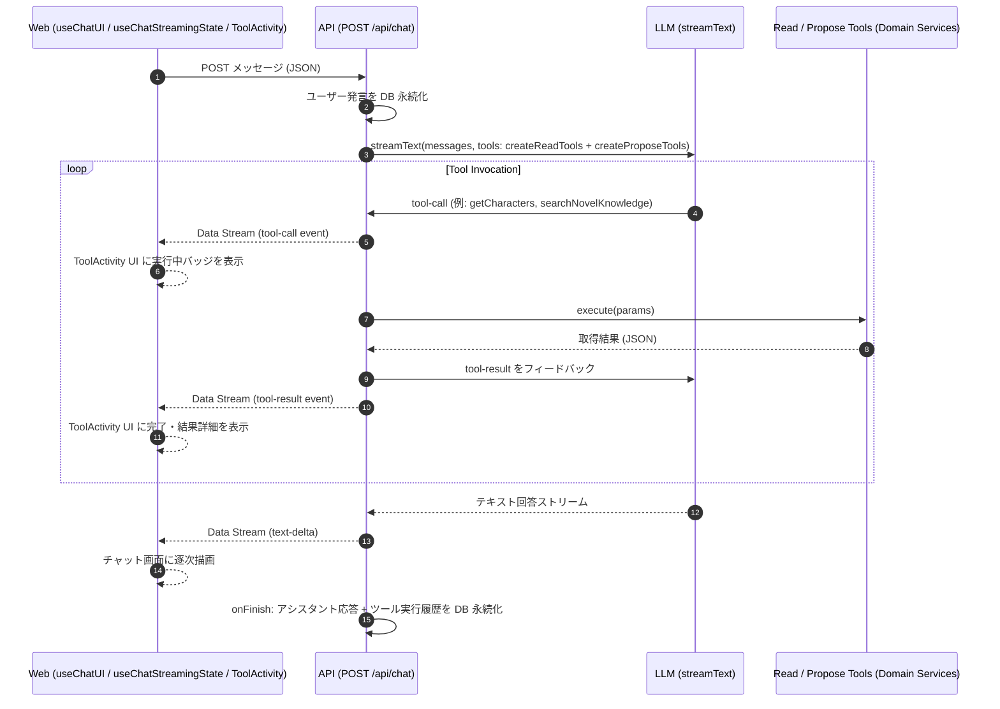

# システムアーキテクチャ

Novel Creator は、最新の TypeScript エコシステムを活用したモノレポ構成のフルスタック Web アプリケーションです。
ローカル開発における快適性と、Cloudflare などのエッジインフラへのデプロイ容易性を両立するよう設計されています。

---

## 1. 全体構成図



---

## 2. モノレポ構造

pnpm ワークスペースを用いたモノレポを採用しており、役割ごとに責務が明確に分離されています。

```
novel-creator/
├── apps/
│   ├── api/             # バックエンド API サーバー (Hono)
│   └── web/             # フロントエンド SPA (React + Vite)
├── packages/
│   ├── db/              # データベース層 (Drizzle ORM + PostgreSQL)
│   ├── llm/             # LLM 連携層 (Vercel AI SDK + プロンプト定義)
│   ├── shared/          # 共通ユーティリティ (Markdown パース, 差分計算, 相関図等)
│   └── vector/          # ベクトル検索層 (VectorStore 抽象化)
├── docker/              # PostgreSQL + pgvector Dockerfile
├── doc/                 # 設計・仕様ドキュメント群
└── package.json         # ルート package.json
```

### パッケージごとの責務

| パッケージ / アプリ   | 主な技術スタック                                                      | 責務と特徴                                                                                                                                                         |
| :-------------------- | :-------------------------------------------------------------------- | :----------------------------------------------------------------------------------------------------------------------------------------------------------------- |
| **`apps/web`**        | React 19, Vite, TanStack Router/Query, Tailwind CSS v4, Monaco Editor | ユーザーインターフェース。ファイルベースルーティングによる画面遷移、MarkdownエディタとカードUIのシームレスな切り替え、SSEストリーミング受信処理。                  |
| **`apps/api`**        | Hono, `@hono/node-server`, Cloudflare Workers (`wrangler`)            | API サーバー。Hono RPC による型安全なエンドポイント提供、SSE ストリーミング生成配信、DB / VectorStore / LLM サービスの結合。                                       |
| **`packages/shared`** | TypeScript, Marked, DOMPurify, Mermaid.js                             | フロント・バックエンド間で共有する純粋関数・型定義。設定・人物 Markdown の双方向パーサー、ルビ・傍点パーサー、AST ベースのセクション差分計算、相関図生成ロジック。 |
| **`packages/db`**     | Drizzle ORM, `postgres`, `pgvector`                                   | DB スキーマ定義、マイグレーション管理、リレーショナルデータアクセス。                                                                                              |
| **`packages/llm`**    | Vercel AI SDK (`ai`), OpenAI, Anthropic, Google, Ollama               | LLM プロバイダの動的切り替え、テキスト生成・ストリーミング制御、Embedding ベクトル生成、構造化プロンプトテンプレート。                                             |
| **`packages/vector`** | `pgvector`, Cloudflare Vectorize SDK                                  | ベクトルデータベースの抽象化（`VectorStore` インターフェース）。ローカル環境と Cloudflare 環境を同一コードで切り替え可能。                                         |

---

## 3. 通信設計: Hono RPC, SSE, & AI SDK UI Message Stream

### 3.1 End-to-End 完全型安全通信 (Hono RPC)

API 定義（`apps/api/src/app.ts`）で公開されるルート型 `AppType` をクライアント側（`apps/web/src/lib/api.ts`）で直接インポートして `hc<AppType>('/')` を初期化します。
これにより、以下が実現されています:

- スキーマ変更時にクライアント側で即座にコンパイルエラーを検知
- URL パスやリクエスト Body、クエリパラメータの自動補完
- OpenAPI などの別途コード生成ステップを必要としない軽量な型共有

```typescript
// apps/web/src/lib/api.ts
import { hc } from 'hono/client';
import type { AppType } from '@novel-creator/api';

export const api = hc<AppType>('/');
```

### 3.2 リアルタイム SSE (Server-Sent Events) ストリーミング (本文生成)

長文の小説執筆において、LLM のレスポンスを待つストレスを解消するため、本文生成には Server-Sent Events を採用しています。

- **バックエンド側**:
  Hono の `streamSSE` ヘルパーを使用し、AI SDK の `streamText` から chunk を受け取りながらクライアントに順次プッシュします。
- **クライアント側**:
  `fetch` API と `ReadableStreamDefaultReader` を用いてチャンクを順次デコードし、Monaco Editor にリアルタイムで逐次反映します。

### 3.3 AI SDK UI Message Stream & Agentic Tool Calling (チャット)

創作相談チャット（Creative Chat）では、AI SDK の標準 **UI Message Stream (`toUIMessageStream` / `createUIMessageStreamResponse`)** を採用しています。



- **サーバーサイド永続化**:
  ユーザー送信時および LLM 応答完了時（`onFinish`）に、ツール呼び出し引数・結果を含む全対話履歴を `chat_sessions` テーブルに自動永続化します。
- **ツール実行の視覚化 (`ToolActivity`)**:
  AI が小説のプロット、設定、人物、本文、伏線、年表、ベクトルナレッジを自律的に検索・参照している様子が `ToolActivity` コンポーネントを通じてリアルタイムにユーザーに可視化されます。

---

## 4. 実行環境ハイブリッド設計

ローカル開発での高速な反復と、運用コストを抑えたサーバーレス（Cloudflare）運用の両方に対応できるよう設計されています。

| 項目                 | ローカル開発環境                                | Cloudflare 本番/ステージング環境                                      |
| :------------------- | :---------------------------------------------- | :-------------------------------------------------------------------- |
| **Web ホスティング** | Vite Dev Server (`localhost:5173`)              | Cloudflare Pages (静的アセット配信)                                   |
| **API サーバー**     | Node.js (`@hono/node-server`, `localhost:3000`) | Cloudflare Workers (エッジランタイム)                                 |
| **データベース**     | Docker (PostgreSQL 17)                          | 外部 PostgreSQL + Cloudflare Hyperdrive (接続プーリング & キャッシュ) |
| **ベクトルDB**       | Docker (`pgvector/pgvector:pg17`)               | Cloudflare Vectorize                                                  |
| **LLM 接続**         | 直通 API 呼び出し (またはローカル Ollama)       | 直通 API 呼び出し (Workers 上で fetch)                                |
