# データモデル & データベース設計

Novel Creator では、リレーショナルデータ（小説の階層構造、人物、設定、履歴など）の保存に **PostgreSQL (Drizzle ORM)** を使用し、類似度検索（セマンティック検索）のための埋め込みベクトル保存に **VectorStore (pgvector / Cloudflare Vectorize)** を使用しています。

---

## 1. ER ダイアグラム (Entity-Relationship Diagram)

```mermaid
erDiagram
    novels ||--o{ chapters : "has"
    novels ||--o{ characters : "has"
    novels ||--o{ settings : "has"
    novels ||--o{ timelines : "has"
    novels ||--o{ foreshadowings : "has"
    novels ||--o{ ideas : "has"
    novels ||--o{ analysis_results : "has"
    novels ||--o{ chat_sessions : "has"
    chat_sessions ||--o{ chat_messages : "has"
    novels ||--o{ llm_instructions : "has"
    novels ||--o{ edit_histories : "has"
    novels ||--o{ custom_prompts : "has (optional)"
    novels ||--o{ mcp_api_keys : "has (optional)"

    chapters ||--o{ sections : "has"
    sections ||--o| contents : "has"
    sections ||--o{ timelines : "associated with"
    sections ||--o{ foreshadowings : "placed in / resolved in"
    sections ||--o{ edit_histories : "logs"

    novels {
        uuid id PK
        text title
        text description
        timestamp created_at
        timestamp updated_at
    }

    chapters {
        uuid id PK
        uuid novel_id FK
        text title
        integer sort_order
        text summary
        timestamp created_at
        timestamp updated_at
    }

    sections {
        uuid id PK
        uuid chapter_id FK
        text title
        integer sort_order
        text summary
        timestamp created_at
        timestamp updated_at
    }

    contents {
        uuid id PK
        uuid section_id FK
        text content
        integer char_count
        timestamp created_at
        timestamp updated_at
    }

    characters {
        uuid id PK
        uuid novel_id FK
        text category
        text name
        text description
        jsonb traits
        jsonb relationships
        timestamp created_at
        timestamp updated_at
    }

    settings {
        uuid id PK
        uuid novel_id FK
        text category
        text name
        text description
        jsonb metadata
        timestamp created_at
        timestamp updated_at
    }

    timelines {
        uuid id PK
        uuid novel_id FK
        uuid section_id FK
        text event
        text in_universe_time
        integer sort_order
        timestamp created_at
        timestamp updated_at
    }

    foreshadowings {
        uuid id PK
        uuid novel_id FK
        text title
        text description
        text status "unresolved | resolved | abandoned"
        uuid placed_section_id FK
        uuid resolved_section_id FK
        timestamp created_at
        timestamp updated_at
    }

    chat_sessions {
        uuid id PK
        uuid novel_id FK
        text title
        timestamp created_at
        timestamp updated_at
    }

    chat_messages {
        uuid id PK
        uuid session_id FK
        text role
        text content
        jsonb parts
        timestamp created_at
    }

    llm_instructions {
        uuid id PK
        uuid novel_id FK
        text instruction_type
        text prompt
        text target_type
        uuid target_id
        timestamp created_at
    }

    edit_histories {
        uuid id PK
        uuid novel_id FK
        text target_type "content | character | setting"
        uuid target_id
        text before_text
        text after_text
        text prompt
        timestamp created_at
    }

    custom_prompts {
        uuid id PK
        uuid novel_id FK "Nullable (NULL=Global)"
        text name
        text description
        text icon
        text category "inline | generation | chat | general"
        text system_prompt
        text user_prompt
        integer order
        timestamp created_at
        timestamp updated_at
    }

    ideas {
        uuid id PK
        uuid novel_id FK
        text title
        text body
        text status "draft | adopted | rejected"
        text source
        timestamp created_at
        timestamp updated_at
    }

    analysis_results {
        uuid id PK
        uuid novel_id FK
        text analysis_type "story-arc | check-voice | persona-review"
        uuid target_chapter_id
        uuid target_section_id
        jsonb result
        timestamp created_at
    }

    mcp_api_keys {
        uuid id PK
        text user_id FK
        uuid novel_id FK "Nullable (NULL=Global)"
        text name
        text prefix
        text key_hash UK
        text encrypted_key
        timestamp expires_at
        timestamp revoked_at
        timestamp created_at
        timestamp updated_at
    }

    llm_configs {
        uuid id PK
        text name
        text provider
        text model_id
        text api_key "enc:v1:..."
        text base_url
        boolean is_default
        timestamp created_at
        timestamp updated_at
    }

    embedding_configs {
        uuid id PK
        text name
        text provider
        text model_id
        integer dimensions
        text api_key "enc:v1:..."
        text base_url
        boolean is_default
        timestamp created_at
        timestamp updated_at
    }
```



---

## 2. テーブル仕様一覧

### 2.1 小説・構成・本文系

| テーブル名     | 説明                        | 主要カラム                                                | 外部キー制約                           |
| :------------- | :-------------------------- | :-------------------------------------------------------- | :------------------------------------- |
| **`novels`**   | 小説の基本情報              | `id` (PK), `title`, `description`                         | -                                      |
| **`chapters`** | 章情報（階層の上位）        | `id` (PK), `novel_id`, `title`, `sort_order`, `summary`   | `novel_id` → `novels.id` (CASCADE)     |
| **`sections`** | 節/シーン情報（階層の下位） | `id` (PK), `chapter_id`, `title`, `sort_order`, `summary` | `chapter_id` → `chapters.id` (CASCADE) |
| **`contents`** | 節ごとの本文データ          | `id` (PK), `section_id`, `content`, `char_count`          | `section_id` → `sections.id` (CASCADE) |

### 2.2 設定・世界観・人物・構想系

| テーブル名           | 説明                         | 主要カラム                                                                                          | 特徴                                                                                                            |
| :------------------- | :--------------------------- | :-------------------------------------------------------------------------------------------------- | :-------------------------------------------------------------------------------------------------------------- |
| **`characters`**     | 登場人物データ               | `id` (PK), `novel_id`, `category`, `name`, `description`, `traits`, `relationships`                 | `traits` は配列 JSONB、`relationships` はターゲット人物名や関係性の JSONB 構造。Markdown との双方向同期に対応。 |
| **`settings`**       | 世界観・魔法・地理などの設定 | `id` (PK), `novel_id`, `category`, `name`, `description`, `metadata`                                | カテゴリ単位（例: 地理/国家、魔法体系）でツリー構造化して管理。                                                 |
| **`timelines`**      | 作中の時系列・年表           | `id` (PK), `novel_id`, `section_id`, `event`, `in_universe_time`, `sort_order`                      | 作中時間（例:「帝国歴120年 春」）と節の紐付けを管理。                                                           |
| **`foreshadowings`** | 伏線の設置と回収管理         | `id` (PK), `novel_id`, `title`, `description`, `status`, `placed_section_id`, `resolved_section_id` | 未回収（unresolved）・回収済み（resolved）・破棄（abandoned）のステータス管理、設置節・回収節へのリレーション。 |
| **`ideas`**          | アイデア帳・着想メモ         | `id` (PK), `novel_id`, `title`, `body`, `status`, `source`                                          | 創作の着想メモ。ステータス（`draft`/`adopted`/`rejected`）管理、MCPツール連携による発散からプロット化に対応。    |

### 2.3 対話・AI・履歴・分析系

| テーブル名             | 説明                        | 主要カラム                                                                               | 特徴                                                                                                             |
| :--------------------- | :-------------------------- | :--------------------------------------------------------------------------------------- | :--------------------------------------------------------------------------------------------------------------- |
| **`chat_sessions`**    | AI 創作相談チャット履歴     | `id` (PK), `novel_id`, `title`                                                          | セッションのメタ情報（タイトル・権限モード）を管理。メッセージ本体は `chat_messages` テーブルに保存。             |
| **`chat_messages`**    | チャットメッセージ          | `id` (PK), `session_id`, `role`, `content`, `parts`                                     | ユーザー発言・AI応答・ツール呼び出しを 1 行 1 メッセージで永続化。`parts` は AI SDK UIMessage 形式の JSONB（null 許容）。 |
| **`analysis_results`** | ストーリー分析結果履歴      | `id` (PK), `novel_id`, `analysis_type`, `target_chapter_id`, `target_section_id`, `result` | 感情アーク（story-arc）、口調ブレ（check-voice）、ペルソナレビュー（persona-review）の実行結果 JSON を永続化。     |
| **`llm_instructions`** | LLM 指示の実行履歴          | `id` (PK), `novel_id`, `instruction_type`, `prompt`, `target_type`, `target_id`          | 過去に実行したプロンプトを記録し、UI 上（`PromptHistoryList`）での再利用や確認に活用。                           |
| **`edit_histories`**   | 編集差分履歴（Undo/Diff用） | `id` (PK), `novel_id`, `target_type`, `target_id`, `before_text`, `after_text`, `prompt` | AI による一括変更や執筆の変更前・変更後を保存し、`HistoryDiffModal` で視覚的な差分確認・ロールバックを提供。     |
| **`custom_prompts`**   | カスタムプロンプト設定      | `id` (PK), `novel_id`, `name`, `description`, `icon`, `category`, `user_prompt`, `order` | ユーザー定義のプロンプトテンプレート。作品専用および全作品共通のスコープ管理、変数展開に対応。                   |

### 2.4 システム・連携・認証系

| テーブル名              | 説明                        | 主要カラム                                                                                              | 特徴                                                                                                             |
| :---------------------- | :-------------------------- | :------------------------------------------------------------------------------------------------------ | :--------------------------------------------------------------------------------------------------------------- |
| **`mcp_api_keys`**      | MCP API キー管理            | `id` (PK), `user_id`, `novel_id`, `name`, `prefix`, `key_hash`, `encrypted_key`, `expires_at`, `revoked_at` | Web 発行キー管理。平文は発行時のみ返却し、DB には SHA-256 ハッシュと AES-GCM 暗号文（enc:v1）を保持。失効・有効期限対応。 |
| **`llm_configs`**       | LLM プロバイダ個別設定      | `id` (PK), `name`, `provider`, `model_id`, `api_key`, `base_url`, `is_default`                           | Web UI から動的に追加可能な LLM プロバイダ・モデル設定。API キーはサーバ内暗号化（enc:v1）保持。                |
| **`embedding_configs`** | 埋め込みモデル個別設定      | `id` (PK), `name`, `provider`, `model_id`, `dimensions`, `api_key`, `base_url`, `is_default`            | Web UI から追加可能なベクトル埋め込みモデル設定（次元数指定対応）。API キー暗号化保持。                        |

---

## 3. ベクトルデータモデル (VectorStore)

LLM による RAG（検索拡張生成）を実現するため、登場人物や世界観設定のテキストは VectorStore にも登録されます。

### 3.1 レコード構造 (`VectorRecord`)

```typescript
export interface VectorRecord {
  id: string; // ベクトルレコード UUID
  novelId: string; // 小説ID（小説ごとの分離用フィルタ）
  entityType: string; // 'character' | 'setting' | 'section' 等
  entityId: string; // 元エンティティの UUID
  content: string; // 検索ヒット時にコンテキストへ注入する原文テキスト
  metadata?: Record<string, unknown>; // カテゴリやタイトル等の追加メタデータ
  embedding: number[]; // 埋め込みベクトル (768次元 / 1536次元 等)
}
```

### 3.2 ストレージ実装の差異

1. **`PgVectorStore` (ローカル PostgreSQL)**
   - `embeddings` テーブルを作成し、`pgvector` の `vector` 型カラムにコサイン距離インデックス（HNSW / IVFFlat）を適用。
   - SQL クエリ: `ORDER BY embedding <=> $1 LIMIT $2` を用いて、`novel_id` や `entity_type` でフィルタリングしながら高速検索。
2. **`VectorizeStore` (Cloudflare Vectorize)**
   - Cloudflare のグローバル分散 Vector DB。
   - `id`, `values` (ベクトル), `metadata` (JSON) で格納し、`vectorize.query()` による類似度検索を実行。

---

## 4. DB運用 (スキーマ変更フロー)

スキーマ変更の適用は **マイグレーション (`db:migrate`) を正** とする。

- **`db:migrate`** が、すべての環境（ローカル開発・CI・本番）で唯一の正規の適用方法。
  新規環境の初期構築（`db:setup`）を含め、`packages/db/drizzle/` 配下のマイグレーションファイルを順に適用してスキーマを構築する。
- **`db:push`**（Drizzle Kit push）は破棄可能なローカル試作専用。スキーマを DB に直接反映するため、マイグレーション履歴 (`drizzle.__drizzle_migrations`) と実 DB の状態に**ドリフト（不一致）**を生む。
  **マイグレーション済みの DB に対して `db:push` を実行してはならない**（例: 後から `db:migrate` を実行すると `relation "xxx_idx" already exists` で失敗する）。
- スキーマ変更の標準フロー: `db:generate` でマイグレーションファイルを生成 → `db:migrate` で適用。

### 運用の統一（対応済み）

`db:setup` は migrate ベースに統一済み（`docker compose up -d && pnpm --filter @novel-creator/db db:migrate`）。
`db:push` は `db:setup:fresh` に分離し、破棄可能な使い捨て試作専用とする。migrate 済み DB には実行禁止。

### データベースのリセット (`db:reset`)

開発中にデータベーススキーマを完全に初期化したい場合、`pnpm db:reset` を実行します。

- **動作内容**: `DATABASE_URL` の `search_path`（未指定時は `public`）を検出し、`DROP SCHEMA IF EXISTS "<schema>" CASCADE;` を実行した上で `CREATE SCHEMA` を再作成します。`public` スキーマの場合は `CREATE EXTENSION IF NOT EXISTS vector;` も自動的に再実行されます。
- **リセット後の復旧**: `pnpm db:reset` 実行後は、`pnpm db:migrate` を実行して初期マイグレーションからクリーンに適用し直します。
- **マルチテナント・テスト環境の分離**: `DATABASE_URL` のクエリパラメータ（例: `?search_path=test_schema`）に応じたスキーマ単位のリセットが安全に行えます。
