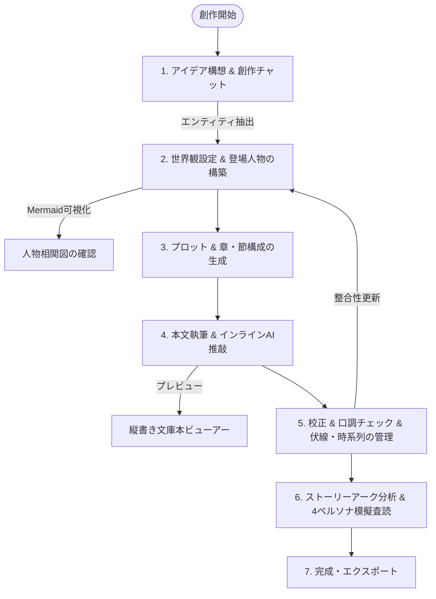

# 機能詳細 & 創作ワークフロー

Novel Creator では、作家の思考の流れを妨げずに AI が伴走できるよう、各種機能が直感的かつ有機的に連携しています。

---

## 1. 小説創作の標準ワークフロー

---

## 2. 主要機能詳細

### 2.1 AI 創作相談チャット (Creative Chat & Agentic Tool Calling)

- **AI SDK UI Message Stream によるリアルタイム対話**:
  AI SDK 4.x の標準 Data Stream Protocol に準拠し、応答テキストおよびツール実行ログをリアルタイムにストリーミング表示。対話履歴はサーバー側で自動永続化されます。
- **Agentic な小説データ参照 (Tool Calling)**:
  LLM が自律的に 8 種類の専用ツールを実行（小説情報、人物、設定、プロット、節本文、伏線、年表、ベクトル検索）。ユーザーが細かい文脈を前提にせず質問しても、必要な背景データを自分で取得して的確に回答します。
- **ツール実行状態の可視化 (`ToolActivity`)**:
  ツールの実行中・完了状態や引数・戻り値をチャット画面内に分かりやすくカード表示。
- **エンティティのワンクリック抽出・反映**:
  チャット内で決定した新しいキャラクターや世界観設定を、AI が自動抽出（`extractChatEntities`）。作家は確認モーダル上で **「新規追加」「上書き更新」「マージ」** を選択して小説データに直接反映できます。

---

### 2.2 設定・登場人物の管理（個別編集 & Markdown 双方向同期）

- **GUI（カード一覧 / 個別編集）とテキスト（Markdown 一括編集）の統合**:
  一覧カード表示、専用フォーム画面（`/novels/:id/characters/:charId`, `/settings/:settingId`）、そして Markdown 一括エディタの 3 つのスタイルを自由に使い分けられます。
- **AI による下書き自動生成 (`createSettingDraft` / `createCharacterDraft`)**:
  個別作成画面でキャラクター名や設定名と簡単な要望を入力するだけで、AI が特徴・詳細説明・背景・関係性のドラフトを一括生成します。
- **Markdown シリアライズ & パース (`packages/shared`)**:
  DB 内の構造化データを特定記法の Markdown（`# カテゴリ`、`## 名前`、`- 特徴:`、`- 関係性:` 等）にシリアライズ。
- **リアルタイム AST 解析とカテゴリツリー**:
  エディタ横に目次ツリー（Outline）を自動生成し、カーソル位置のセクションをハイライト。
- **差分検知（Diff）とドラフト自動保護**:
  編集中にローカルストレージへドラフトを自動保存。保存時には変更された項目（追加・更新・削除）のみを精密に DB へ適用。
- **セクション単位の AI 自然言語編集**:
  「この人物の口調を古風に変更して」「魔法の制約を厳しくして」といった指示を出すと、該当セクションのみをピンポイントで LLM が書き換えます。

---

### 2.3 人物相関図 & 出現頻度ヒートマップ

- **人物相関図の自動生成 (`CharacterGraphModal` / Mermaid.js)**:
  - 登場人物の `category`（勢力・所属）を `subgraph` に分類。
  - 各人物の `relationships`（例:「田中: 幼馴染」「魔王: 敵対」）を解析し、Mermaid.js のノード・エッジ形式に変換。
- **登場人物・出現頻度ヒートマップ (`CharacterHeatmapModal`)**:
  - 全章・全節におけるキャラクターの登場回数をマトリックス集計。
  - 所属・勢力フィルタリングおよび、長期間出番のないキャラクター（⚠️ 出番なし）の自動検知。

---

### 2.4 プロット・章・節（シーン）の段階的生成 & 構成整理

1. **プロット生成**: RAG を通じて既存設定を反映した全体のストーリー展開を生成。
2. **章概要の一括生成**: プロットを分解し、全章のタイトルと概要を自動設計。
3. **節概要の生成**: 各章ごとに 3〜5 つの節（シーン）を自動設計。
4. **章・節の並び替え・移動**: ドラッグ＆ドロップおよび移動アクションにより、物語の構成順を柔軟に変更可能。
5. **本文ストリーミング執筆**:
   - 前の節の末尾、現在の節的概要、関連設定・人物をコンテキストに含めてストリーミング生成。
   - Monaco Editor 上でリアルタイムに文字が綴られ、作家がその場で加筆・修正可能。

---

### 2.5 執筆・エディタ体験の強化

- **文庫本風 縦書きプレビュー (`VerticalPreviewModal`)**:
  - CSS `writing-mode: vertical-rl` による縦書き表示。
  - 明朝体 / ゴシック体の切替、文字サイズ（A- / A+）、行間調整（詰 / 広）。
  - `|漢字《かんじ》`（ルビ記法）および `《《傍点》》`（傍点記法）をパースして美しく組版表示。
- **インライン AI 推敲・加筆 (`InlineAIAssistant`)**:
  - Monaco Editor上で文章を選択した際に現れるクイックAIツール。
  - 「描写を深める（五感・情景）」「心理・感情強化」「会話をテンポよく」「簡潔にする」「別の言い回し」「自由な個別指示」を選択し、その場でストリーミング生成して「置換」または「直後挿入」。
- **執筆目標 & 進捗トラッキング**:
  - 節単位および作品全体の目標文字数（例: 100,000字）を設定可能。
  - 読了目安時間（約400文字/分換算）と達成度プログレスバーをリアルタイム表示。

---

### 2.6 キャラクター・整合性管理の深化

- **キャラクター口調・一貫性チェッカー (`CharacterVoiceCheckerModal`)**:
  - 登録された人物設定（一人称、二人称、口調・語尾特徴、詳細設定）と本文のセリフを照合。
  - 一人称矛盾、語尾ブレ、キャラ崩壊（キャラブレ）を検出し、設定に忠実な改善セリフ案を提示・ワンクリック反映。
- **設定変更の影響範囲シミュレーター (`ImpactAnalysisModal`)**:
  - 設定や人物設定の変更前後の差分を入力し、影響を受ける全プロット・章節・年表・伏線をAIがシミュレーション分析。
- **伏線管理 (`ForeshadowingTab`)**:
  - 伏線のタイトル、概要、ステータス（未回収 / 回収済み / 破棄）を管理し、設置節・回収節をリンク付け。
- **時系列管理 (`TimelineTab`)**:
  - 作中時間順にイベントをタイムライン表示。本文からの自動整合性抽出に対応。

---

### 2.7 ストーリー分析 & AIペルソナレビュー

- **共通基盤（3分析機能すべてに共通）**:
  - **進捗表示**: 分析実行中は SSE ストリーミングで進捗イベント（「章・節の本文を収集中」「AIが分析中」等）を随時通知し、進捗バー・経過時間・キャンセル操作をモーダル内に表示。
  - **結果の自動保存 & 履歴再確認**: すべての分析結果は `analysis_results` テーブルに自動保存され、モーダル内の「履歴」から過去の結果をいつでも再表示・再実行・削除可能。
  - **日本語出力の強制**: 各分析プロンプトに「すべてのテキスト値は必ず日本語で出力」する旨を明記し、LLM の出力言語を日本語に固定。
  - **全体分析の本文補完**: 節・章・本文を指定せず全体分析を実行した場合、全章節の本文を自動結合して AI に送信（旧来は空本文が送られていた不具合を修正）。
- **物語のテンション & 感情アーク可視化 (`StoryArcChartModal`)**:
  - 全章・節の「緊張感（Tension: 0〜100）」と「感情価（Valence: -100 絶望 ⇄ +100 歓喜）」をAIスコアリング。
  - SVG 折れ線グラフで起伏を描画し、中だるみ区間の指摘や各節の盛り上げ助言を表示。
- **キャラクター口調・一貫性チェッカー (`CharacterVoiceCheckerModal`)**:
  - 人物設定（一人称・二人称・語尾）と本文セリフを照合し、ブレ・キャラ崩壊を検出（全体 / 節単位の両方に対応）。
- **4ペルソナによる模擬読者・編集部レビュー (`MultiPersonaReviewModal`)**:
  - **商業ラノベ・文芸編集者**: 商業的ポテンシャル、引きの強さ、テンポの厳格査読。
  - **一般エンタメ読者**: 面白さ、感情移入度、推せるポイントの素直な感想。
  - **世界観・設定考察派ファン**: 設定の緻密さ、伏線の仕込み、説得力の考察。
  - **辛口文芸評論家**: 文体、テーマ性、心理描写の深みへの批評。

---

### 2.8 校正・履歴管理 & エクスポート

- **本文校正 (`ProofreadModal`)**:
  - 執筆済み本文の誤字脱字、視点ブレ、不自然な表現、語彙の重複、リズムなどを AI が分析・指摘。推敲後全文のワンクリック反映に対応。
- **プロンプト実行履歴 (`PromptHistoryList`)**:
  - 過去に実行したプロンプトや生成指示を履歴として一覧表示し、再利用を支援。
- **編集差分履歴 (`HistoryDiffModal`)**:
  - AI による一括生成・編集の前後テキストを `edit_histories` テーブルに記録。ビジュアルな差分比較とワンクリックでのロールバックを提供。
- **バックアップ & リストア**: 小説の設定、章節、本文、チャット履歴、時系列、伏線をすべて含んだ JSON ファイルのインポート / エクスポート。
- **小説テキスト出力 (`ExportModal`)**:
  - プレーンテキスト (`.txt`)
  - Markdown (`.md`)
  - ルビや章タイトル、文字数統計を含めた整形出力に対応。
