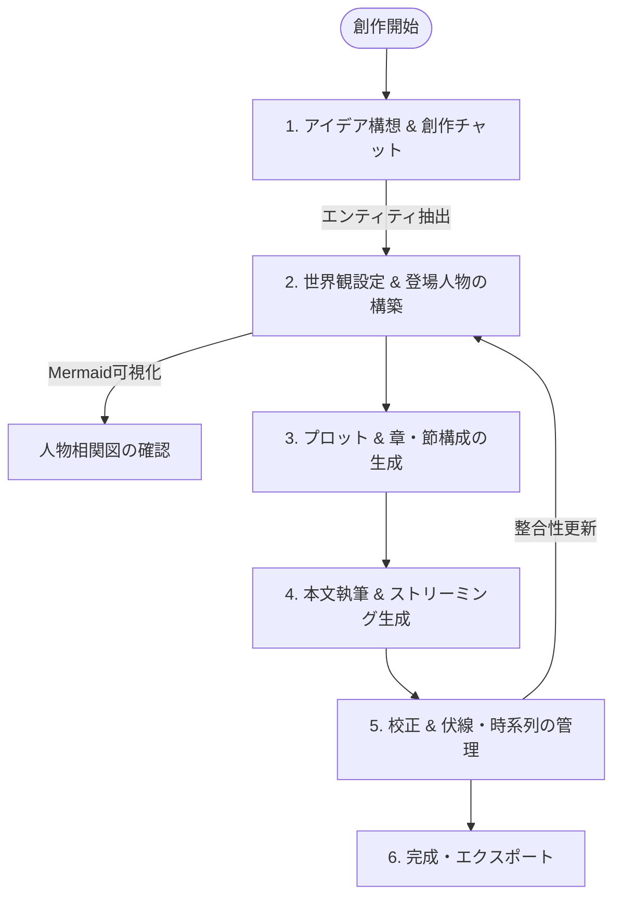

# 機能詳細 & 創作ワークフロー

Novel Creator では、作家の思考の流れを妨げずに AI が伴走できるよう、各種機能が直感的かつ有機的に連携しています。

---

## 1. 小説創作の標準ワークフロー



---

## 2. 主要機能詳細

### 2.1 AI 創作相談チャット (Creative Chat)

- **文脈を共有したブレインストーミング**:
  登録済みの小説タイトル、概要、人物、設定を背景情報として LLM に提供し、アイデア出しやプロットの展開相談を行います。
- **エンティティのワンクリック抽出・反映**:
  チャット内で決定した新しいキャラクターや世界観設定を、AI が自動抽出（`extractChatEntities`）。
  作家は確認モーダル上で **「新規追加」「上書き更新」「マージ」** を選択して小説データに直接反映できます。

---

### 2.2 設定・登場人物の「Markdown 双方向同期」

Novel Creator の最大の特徴の一つが、GUI（カード一覧）とテキスト（Markdown エディタ）のシームレスな統合です。

```
┌─────────────────────────┐          ┌─────────────────────────┐
│     カード / GUI表示     │ ◄──────► │   Markdown 一括編集     │
│ (一覧・ドラッグ・フォーム) │          │ (Monaco Editor / ツリー) │
└─────────────────────────┘          └─────────────────────────┘
```

- **Markdown シリアライズ & パース (`packages/shared`)**:
  DB 内の構造化データを特定記法の Markdown（`# カテゴリ`、`## 名前`、`- 特徴:`、`- 関係性:` 等）にシリアライズ。
- **リアルタイム AST 解析とカテゴリツリー**:
  エディタ横に目次ツリー（Outline）を自動生成し、カーソル位置のセクションをハイライト。
- **差分検知（Diff）とドラフト自動保護**:
  編集中にローカルストレージへドラフトを自動保存。保存時には変更された項目（追加・更新・削除）のみを精密に DB へ適用。
- **セクション単位の AI 自然言語編集**:
  「この人物の口調を古風に変更して」「魔法の制約を厳しくして」といった指示を出すと、該当セクションのみをピンポイントで LLM が書き換えます。

---

### 2.3 人物相関図の自動生成 (Mermaid.js)

- 登場人物の `category`（勢力・所属）を `subgraph` に分類。
- 各人物の `relationships`（例:「田中: 幼馴染」「魔王: 敵対」）を解析し、Mermaid.js のノード・エッジ形式に変換。
- 作家はいつでもワンクリックで最新の相関図モーダルを表示・確認できます。

---

### 2.4 プロット・章・節（シーン）の段階的生成

1. **プロット生成**: RAG を通じて既存設定を反映した全体のストーリー展開を生成。
2. **章概要の一括生成**: プロットを分解し、全章のタイトルと概要を自動設計。
3. **節概要の生成**: 各章ごとに 3〜5 つの節（シーン）を自動設計。
4. **本文ストリーミング執筆**:
   - 前の節の末尾、現在の節の概要、関連設定・人物をコンテキストに含めてストリーミング生成。
   - Monaco Editor 上でリアルタイムに文字が綴られ、作家がその場で加筆・修正可能。

---

### 2.5 伏線・時系列の管理と整合性更新

- **伏線管理 (`ForeshadowingTab`)**:
  - 伏線のタイトル、概要、ステータス（未回収 / 回収済み / 破棄）を管理。
  - 「どの節で伏線を設置したか」「どの節で回収したか」をリンク付け。
- **時系列管理 (`TimelineTab`)**:
  - 作中時間（例:「第一紀 500年」「3日目の夜」）順にイベントをタイムライン表示。
- **本文からの整合性自動抽出**:
  - 執筆した本文を解析し、新たに登場した設定や時系列イベントを LLM が自動抽出して DB に提案・追加。

---

### 2.6 バックアップ・リストア・エクスポート

- **JSON バックアップ**: 小説の設定、章節、本文、チャット履歴、時系列、伏線をすべて含んだ JSON ファイルのインポート / エクスポート。
- **小説テキスト出力 (`ExportModal`)**:
  - プレーンテキスト (`.txt`)
  - Markdown (`.md`)
  - ルビや章タイトル、文字数統計を含めた整形出力に対応。
