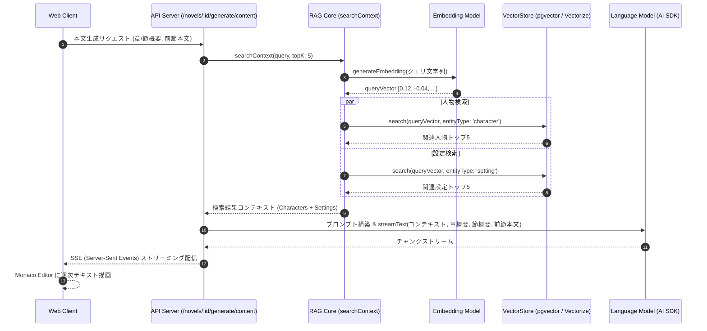

# LLM 連携 & RAG アーキテクチャ

Novel Creator では、**Vercel AI SDK (`ai`)** を基盤とし、複数の LLM / Embedding プロバイダのシームレスな切り替えと、ベクトル検索を活用した RAG (Retrieval-Augmented Generation) パイプラインを実装しています。

---

## 1. LLM / Embedding プロバイダの抽象化

### 1.1 マルチプロバイダ対応

小説執筆用 LLM と、検索用 Embedding でそれぞれ異なるプロバイダやモデルを独立して設定可能です。

```
[環境設定]
LLM_PROVIDER       = "anthropic"  (例: Claude 3.5 Sonnet / 3.7 Sonnet)
EMBEDDING_PROVIDER = "google"     (例: text-embedding-004)
```

| プロバイダ        | 対応機能        | 特記事項                                                                                                   |
| :---------------- | :-------------- | :--------------------------------------------------------------------------------------------------------- |
| **OpenAI**        | LLM / Embedding | GPT-4o, GPT-4o-mini, text-embedding-3-small 等                                                             |
| **Anthropic**     | LLM             | Claude 3.5 Sonnet, Claude 3.7 Sonnet 等（Embedding 非対応のため自動的に OpenAI/Google 等にフォールバック） |
| **Google Gemini** | LLM / Embedding | Gemini 2.5 Flash, Gemini 1.5 Pro, text-embedding-004（`outputDimensionality` による次元数指定対応）        |
| **Ollama**        | LLM / Embedding | ローカル LLM（Llama 3, Qwen 2.5, DeepSeek R1 等）のオフライン動作・無料運用                                |

### 1.2 堅牢なエラーハンドリング & リトライ機構

ネットワークエラー、HTTP 429 (Rate Limit)、HTTP 500 系エラーに対して、**指数バックオフ付き自動リトライ (`withRetry`)** を備えています。また、LLM が Markdown コードブロック（`json ... `）を付与して返した場合でも、`generateJSON<T>` 内で自動トリム・パースする堅牢な実装となっています。

---

## 2. RAG (検索拡張生成) パイプライン

長編小説では、物語の進行に伴って登場人物や世界観設定が膨大になり、コンテキストウィンドウの上限やコスト、プロンプト汚染が問題になります。
Novel Creator では、執筆対象のシーンに必要な情報だけを動的に抽出してプロンプトに注入します。



### 2.1 ベクトル登録 (`upsertEntityEmbedding`)

登場人物や設定が更新・追加されると、自動的に Embedding が生成され、VectorStore に登録（古いベクトルの削除 + 新規 Upsert）されます。

```typescript
// apps/api/src/rag.ts
export async function upsertEntityEmbedding(
  vectorStore: VectorStore,
  embedding: EmbeddingModel,
  novelId: string,
  entityType: string,
  entityId: string,
  content: string,
  env: Env,
): Promise<void> {
  const providerOptions = buildEmbeddingProviderOptions(env);
  const vector = await generateEmbedding(embedding, content, { providerOptions });
  await vectorStore.deleteByEntity(entityType, entityId);
  await vectorStore.upsert({
    id: randomUUID(),
    novelId,
    entityType,
    entityId,
    content,
    embedding: vector,
  });
}
```

---

## 3. プロンプト設計と生成タスク

`packages/llm/src/prompts` に各創作フェーズに特化したプロンプトテンプレートが集約されています。

| プロンプトモジュール                                          | 役割と入力                                                                    | 出力フォーマット                      |
| :------------------------------------------------------------ | :---------------------------------------------------------------------------- | :------------------------------------ |
| **`plotGenerationPrompt`**                                    | タイトル、説明、RAGコンテキスト（設定・人物）からプロット全体の起承転結を生成 | Markdown 形式のプロット構想案         |
| **`chapterSummaryPrompt`**                                    | 小説全体のプロットから、各章（第1章〜最終章）のタイトルと概要一覧を生成       | JSON 配列 (`[{ title, summary }]`)    |
| **`sectionSummaryPrompt`**                                    | 特定の章の概要から、章を構成する節（シーン）のタイトルと詳細概要を生成        | JSON 配列 (`[{ title, summary }]`)    |
| **`contentGenerationPrompt`**                                 | 前節の末尾本文、当該節の概要、関連設定・人物テキストを注入して本文を生成      | ストリーミング小説本文                |
| **`proofreadPrompt`**                                         | 執筆済み本文の誤字脱字、表現の重複、表記揺れ、地の文と台詞のバランスを校正    | 校正指摘・修正案一覧                  |
| **`creativeChatPrompt`**                                      | 小説の基本情報・現在の設定・人物を背景知識として持ち、作家と対話              | チャット応答ストリーム                |
| **`extractChatEntitiesPrompt`**                               | チャットログから新しく合意された人物や世界観設定を自動抽出                    | JSON 構造化データ（人物・設定リスト） |
| **`extractSettingsPrompt` / `extractTimelinePrompt`**         | 執筆された本文を解析し、登場した新情報や時系列イベントを抽出                  | JSON 構造化データ（整合性同期用）     |
| **`editCharacterSectionPrompt` / `editSettingSectionPrompt`** | Markdown の特定セクションに対して自然言語指示で部分修正                       | 修正後のセクション Markdown           |
