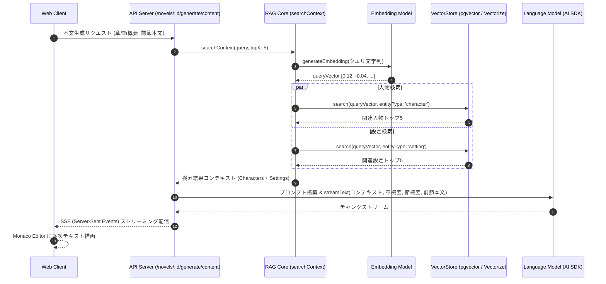

# LLM 連携 & RAG アーキテクチャ

Novel Creator では、**Vercel AI SDK (`ai`)** を基盤とし、複数の LLM / Embedding プロバイダのシームレスな切り替えと、ベクトル検索を活用した RAG (Retrieval-Augmented Generation) パイプラインを実装しています。

---

## 1. LLM / Embedding プロバイダの抽象化

### 1.1 マルチプロバイダ対応 & 動的設定管理

小説執筆用 LLM と、検索用 Embedding でそれぞれ異なるプロバイダやモデルを独立して設定可能です。
環境変数（`.env`）によるシステムデフォルト設定に加え、**Web UI（`/settings`）から動的に LLM / 埋め込みモデルを追加・切り替え可能**です。

```
[環境設定 / UI設定]
LLM_PROVIDER       = "anthropic"  (例: Claude 3.5 Sonnet / 3.7 Sonnet)
EMBEDDING_PROVIDER = "google"     (例: gemini-embedding-001 / text-embedding-3-small)
EMBEDDING_DIMENSIONS = 768 / 1536 / 3072
```

| プロバイダ        | 対応機能        | 特記事項                                                                                                   |
| :---------------- | :-------------- | :--------------------------------------------------------------------------------------------------------- |
| **OpenAI**        | LLM / Embedding | GPT-4o, GPT-4o-mini, text-embedding-3-small (1536d), text-embedding-3-large (3072d) 等                     |
| **Anthropic**     | LLM             | Claude 3.5 Sonnet, Claude 3.7 Sonnet 等（Embedding 非対応のため自動的に OpenAI/Google 等にフォールバック） |
| **Google Gemini** | LLM / Embedding | Gemini 2.5 Flash, Gemini 1.5 Pro, gemini-embedding-001（768次元 / 1536次元指定対応）                       |
| **Ollama**        | LLM / Embedding | ローカル LLM（Llama 3.2, Qwen 2.5）および埋め込みモデル（nomic-embed-text 768d, bge-m3 1024d）             |

### 1.2 ベクトルインデックスの全自動再構築 (Re-indexing)

埋め込みモデルや次元数を変更した際、RDBに保存された全小説の原本データ（登場人物、世界観設定、各節の本文）からベクトルを自動バッチ生成し、インデックスを再作成（DROP & CREATE）するエンドポイント（`POST /api/vector/reindex`）およびプログレスモーダルを提供しています。

### 1.2 堅牢なエラーハンドリング & リトライ機構

ネットワークエラー、HTTP 429 (Rate Limit)、HTTP 500 系エラーに対して、**指数バックオフ付き自動リトライ (`withRetry`)** を備えています。また、LLM が Markdown コードブロック（`json ... `）を付与して返した場合でも、`generateJSON<T>` 内で自動トリム・パースする堅牢な実装となっています。

---

## 2. RAG (検索拡張生成) パイプライン

長編小説では、物語の進行に伴って登場人物や世界観設定が膨大になり、コンテキストウィンドウの上限やコスト、プロンプト汚染が問題になります。
Novel Creator では、執筆対象のシーンに必要な情報だけを動的に抽出してプロンプトに注入します。



### 2.1 ベクトル登録 (`upsertEntityEmbedding`)

登場人物や設定が更新・追加されると、自動的に Embedding が生成され、VectorStore に登録（古いベクトルの削除 + 新規 Upsert）されます。

```typescript
// apps/api/src/rag.ts
export async function upsertEntityEmbedding(
  vectorStore: VectorStore,
  embedding: EmbeddingModel,
  novelId: string,
  entityType: string,
  entityId: string,
  content: string,
  env: Env,
): Promise<void> {
  const providerOptions = buildEmbeddingProviderOptions(env);
  const vector = await generateEmbedding(embedding, content, { providerOptions });
  await vectorStore.deleteByEntity(entityType, entityId);
  await vectorStore.upsert({
    id: randomUUID(),
    novelId,
    entityType,
    entityId,
    content,
    embedding: vector,
  });
}
```

---

## 3. Agentic ツール実行システム (`createReadTools`)

創作相談チャット（Creative Chat）では、静的な RAG 注入だけでなく、LLM が自律的に必要な小説データを参照できるように AI SDK の **Tool Calling 機能** を活用した 8 つの読み取り専用ツール（`readTools`）を提供しています。

### 3.1 提供ツール一覧

| ツール名                   | 引数 (Zod Schema)                                       | 役割と戻り値                                                                 |
| :------------------------- | :------------------------------------------------------ | :--------------------------------------------------------------------------- |
| **`getNovelInfo`**         | `novelId?`                                              | 小説のタイトル、あらすじ、各エンティティの登録件数を取得                     |
| **`getCharacters`**        | `novelId?`, `name?` (部分一致), `category?`             | 登場人物一覧、または名前・カテゴリで絞り込んだ人物詳細（特徴・関係性）を取得 |
| **`getSettings`**          | `novelId?`, `name?` (部分一致), `category?`             | 世界観・設定（用語、地理、魔法等）の一覧または特定設定を取得                 |
| **`getPlotAndChapters`**   | `novelId?`                                              | 全章（Chapter）と各節（Section）のタイトル・順序・プロット概要を取得         |
| **`getSectionContent`**    | `sectionId`                                             | 特定の節の執筆済み本文テキストを取得                                         |
| **`getForeshadowings`**    | `novelId?`, `status?` (`unresolved/resolved/abandoned`) | 伏線一覧、回収状況、設置節・回収節の紐付け情報を取得                         |
| **`getTimelines`**         | `novelId?`                                              | 作中の時系列・年表イベント一覧を取得                                         |
| **`searchNovelKnowledge`** | `query`, `novelId?`                                     | 質問・キーワードに関する人物・設定を VectorStore からセマンティック検索      |

### 3.2 ツール呼び出しとクライアント連携

- **自律的探索**: LLM はユーザーの質問（例:「第2章の伏線と主人公の関係性は？」）に応じて、`getForeshadowings` や `getCharacters`、`getPlotAndChapters` を連鎖的に呼び出して文脈を把握します。
- **UI 表示 (`ToolActivity`)**: AI SDK UI の Data Stream 経由でツール呼び出し（`tool-call`）と実行結果（`tool-result`）がクライアントにリアルタイム配信され、チャット画面上に「設定を検索中」「登場人物を取得完了」といったカードが展開されます。

---

## 4. プロンプト設計と生成タスク

`packages/llm/src/prompts` に各創作フェーズに特化したプロンプトテンプレートが集約されています。

| プロンプトモジュール                                          | 役割と入力                                                                     | 出力フォーマット                      |
| :------------------------------------------------------------ | :----------------------------------------------------------------------------- | :------------------------------------ |
| **`plotGenerationPrompt`**                                    | タイトル、説明、RAGコンテキスト（設定・人物）からプロット全体の起承転結を生成  | Markdown 形式のプロット構想案         |
| **`chapterSummaryPrompt`**                                    | 小説全体のプロットから、各章（第1章〜最終章）のタイトルと概要一覧を生成        | JSON 配列 (`[{ title, summary }]`)    |
| **`sectionSummaryPrompt`**                                    | 特定の章の概要から、章を構成する節（シーン）のタイトルと詳細概要を生成         | JSON 配列 (`[{ title, summary }]`)    |
| **`contentGenerationPrompt`**                                 | 前節の末尾本文、当該節の概要、関連設定・人物テキストを注入して本文を生成       | ストリーミング小説本文                |
| **`proofreadPrompt`**                                         | 執筆済み本文の誤字脱字、表現の重複、表記揺れ、地の文と台詞のバランスを校正     | 校正指摘・推敲後全文案・スコア        |
| **`inlineAssistPrompt`**                                      | 選択範囲に対するピンポイント加筆・心理強化・会話改善・簡潔化・言い回し提案     | ストリーミング推敲本文テキスト        |
| **`checkCharacterVoicePrompt`**                               | 人物設定（一人称・二人称・口調・性格）と本文を照合しキャラ崩壊・口調ブレを検出 | JSON 形式の指摘・理由・改善セリフ案   |
| **`analyzeSettingImpactPrompt`**                              | 設定や人物設定の変更に伴う既存プロット・章節・年表・伏線への影響を予測         | JSON 形式の影響度・矛盾点・修正案     |
| **`analyzeStoryArcPrompt`**                                   | 全章節の緊張感（Tension: 0〜100）と感情価（Valence: -100〜+100）をスコアリング | JSON 形式のアークデータ・助言         |
| **`multiPersonaReviewPrompt`**                                | 商業編集者、一般読者、設定考察派、辛口評論家の4視点による多角査読              | JSON 形式の星評価・講評・リライト助言 |
| **`creativeChatPrompt`**                                      | 小説の基本情報をシステムプロンプトに持ち、自律ツール呼び出しを案内して対話     | チャット応答（ツール呼出/テキスト）   |
| **`extractChatEntitiesPrompt`**                               | チャットログから新しく合意された人物や世界観設定を自動抽出                     | JSON 構造化データ（人物・設定リスト） |
| **`extractSettingsPrompt` / `extractTimelinePrompt`**         | 執筆された本文を解析し、登場した新情報や時系列イベントを抽出                   | JSON 構造化データ（整合性同期用）     |
| **`editCharacterSectionPrompt` / `editSettingSectionPrompt`** | Markdown の特定セクションに対して自然言語指示で部分修正                        | 修正後のセクション Markdown           |
| **`createCharacterDraftPrompt` / `createSettingDraftPrompt`** | 名前や簡単な要望から、人物や設定の詳細な初期ドラフトを自動生成                 | 生成された人物・設定詳細データ        |
